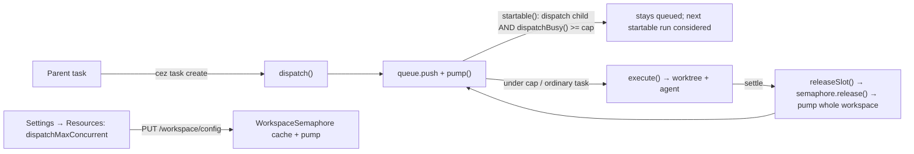

# Dispatch admission cap — an opt-in ceiling on concurrently running dispatch children

> Slug: `dispatch-admission-scheduler` · Status: **design complete (v2.2) — for specification review** · Brief:
> `.ai/specs/briefs/2026-09-20-dispatch-admission-scheduler.md` · Extends
> `.ai/specs/2026-09-10-dispatch.md` (the 0.11 dispatch engine) · Review trail:
> unit `b2a52605` (doctrine/simplicity/UX, verdict *changes*) drove the v2 shape; unit `4289c731`
> (technical, verdict *changes*) reviewed the superseded v1, verified v2's base mechanics, and
> contributed one v2 fix — the `waiting ⊆ active` exclusion in the counter; unit `b24f3534`
> (specification review of this PR, verdict *changes*) found the per-sweep admission counter
> double-counting (`startable()` read and `starting.add` are one synchronous block, so the live
> counter already sees the child), the missing parked-vs-aggregate distinction in the counter's
> rule, and two wrong line citations — all folded into v2.2 · Delivery: one
> implementation PR referencing this spec.

## 📝 TLDR

A parent task can dispatch up to four children in one turn, and every child starts the moment a
shared `maxParallel` slot frees — a fan-out can take every slot from ordinary work. The proposed
behavior adds one opt-in workspace setting, **`resources.dispatchMaxConcurrent`**: the engine
admits a dispatched child only while fewer than N dispatch children are running workspace-wide,
and ordinary tasks keep their normal capacity path. The default (`null`) is byte-for-byte today's
behavior. It is configured in **Settings → Resources** (the browser surface), persisted in
`~/.cezar/config.json`, enforced event-driven inside the existing `pump()` — no database, no new
route, no record field, no browser loop, no timer, no dead-end state.

## 📝 Problem Statement

- **Dispatch has brakes on how much, never on when/how many at once.** 4 children in flight per
  parent (`packages/cezar/src/dispatch/engine.ts:25` defines it, `workflows/run.ts:2035-2038`
  enforces it), a per-tree `maxSubtasks` cap and a
  carved child budget (`engine.ts:62-79`) bound the blast radius, but admission is immediate:
  `dispatch()` → `startRun()` (`workflows/run.ts:1978-2086`, `:1145-1223`) → `queue.push` +
  `pump()` (`:1220-1222`), and `pump()` starts any queued run under
  `semaphore.busy() < maxParallel` and `busySlots() < projectMax` (`:1353-1356`).
- **`maxParallel` is a host cap shared with ordinary tasks.** It answers "how many tasks run",
  never "how many of them may be dispatch children"; a four-child fan-out can saturate the host
  the moment slots free.
- **The gap is named in the shipped design.** `.ai/specs/2026-09-10-dispatch.md` §"Not done
  (deliberately)" lists `mission-scoped concurrency` — the same gap, named for the missions
  experiment the dispatch engine replaced. This spec is the smallest useful slice, and it keeps
  the ceiling workspace-wide rather than per-tree for the reason in A4.
- **Evidence it matters:** the owner asked for a throttle on dispatch-generated runners with no
  database, configured from the cockpit; the three research units
  (`3006b0b7`, `61b93cd8`, `eae13733`) mapped the engines and the browser, and the doctrine review
  (`b2a52605`) showed the concurrency cap is the whole requirement the shipped machinery can
  satisfy without a new state machine.

## 📝 Proposed Solution

1. **One additive workspace resource.** `resources.dispatchMaxConcurrent: number | null` in
   `~/.cezar/config.json` (`null`/`0` = no cap, otherwise `1..16`). Workspace-wide, like
   `maxParallel`, so every browser, project and CLI reads one value; edited in Settings →
   Resources through the existing `PUT /api/v1/workspace/config`.
2. **A per-run predicate in `pump().startable()`** (`run.ts:1379-1383`). When the candidate is a
   dispatch child (`record.dispatch?.parentRunId !== undefined`) and the count of dispatch
   children holding a compute slot (`starting` + `active` − `waiting`) across the workspace has
   reached the cap, the child is skipped and stays in the queue; the sweep then considers the
   next queued run. Ordinary tasks are unaffected — that is the point of a dispatch-specific
   ceiling.
3. **A workspace-wide counter on the existing semaphore.** `WorkspaceSemaphore` gains an optional
   `dispatchBusy?(): number` participant member and sums it across managers exactly like `busy()`
   (`semaphore.ts:151-184`); `RunManager` counts the runs that hold a compute slot — `starting`
   plus `active` minus `waiting` (`waiting ⊆ active` — a parked run is in both sets, which is why
   the subtraction is load-bearing) — whose record has `dispatch.parentRunId`. Note what this rule is NOT: it does
   not reproduce the aggregate bookkeeping `busySlots()` layers on top (`run.ts:1253-1266`
   subtracts ordinary waiting runs, `min(watchers, maxMonitoringSessions)` and spawn-parked
   parents). Those exemptions widen the HOST's parallel budget for parents parked on their own
   children; this counter answers a different question — how many children are running — so a
   child that is `waiting` is excluded by the per-run `waiting` test alone.
4. **Fully event-driven.** `releaseSlot() → semaphore.release()` already pumps the whole workspace
   when a slot frees (`run.ts:1307-1318`), and `PUT /workspace/config` already refreshes the
   semaphore cache and pumps every project (`server.ts:3033`, `semaphore.ts:296`). No timer, no
   deadline wake, no route, no browser liveness dependency.

**Alternatives considered and rejected** (details and evidence in the brief):

| Alternative | Why it loses |
|-------------|--------------|
| Browser lease + `dispatch.held` + `POST /runs/:id/admit` + root controller (drafted v1) | The lease buys per-child *approval*, a different capability; it adds a liveness window, a fail-open/fail-closed product contradiction, a new route and UI, and a stale-chip interval. Deferred to a separate spec. |
| Policy in `localStorage` | A workspace-level choice must agree across browsers and the CLI; the cockpit port/host can change (`localhost:4321` ≠ `127.0.0.1:4321` are different origins), so the policy would silently fork. `BACKWARD_COMPATIBILITY.md` keeps browser state (theme, last location) separate from workspace choices (sidebar order). |
| `minIntervalMs` time pacing | The only knob that needs a deadline wake and not required to bound admission; deferred. |
| New global concurrency cap | `maxParallel` already caps the host; this key is deliberately narrower and composes with it. |
| `held` status or record field | With no approval step there is nothing to mark — a capped dispatch child is simply `queued`. |

## 📝 Architecture



**`WorkspaceSemaphore` (`workspace/semaphore.ts`).** `WorkspaceResourceLimits` gains
`dispatchMaxConcurrent?: number | null` (optional so existing load stubs keep working; absent =
no cap); `DEFAULT_LIMITS` sets `null`; `loadResourceLimits` maps the config key; a
`dispatchMaxConcurrent()` accessor mirrors `memoryLimitMb()` (`:206-208`); the participant
interface gains optional `dispatchBusy?(): number` and the semaphore sums it across projects like
`busy()` (`:175-184`).

**`RunManager` (`workflows/run.ts`).** `dispatchBusy()` counts the slot-holding runs —
`starting`, plus `active` runs that are not `waiting` — whose record carries
`dispatch.parentRunId`. The `startable(id)` closure inside `pump()` gains, after the existing
`accountHeldFor` branch:

```ts
const cap = this.semaphore.dispatchMaxConcurrent();
if (queued && cap !== null && cap > 0 && queued.dispatch?.parentRunId !== undefined
    && this.semaphore.dispatchBusy() >= cap) return false;
return capacity();
```

**No per-sweep counter — adding one would be the bug.** The admission decision
(`findIndex(startable)`, `:1387`) and the admitted run's arrival in `starting` (`:1399`) sit in
the same SYNCHRONOUS block of `pump()`, and `dispatchBusy()` reads the live sets, so a child this
sweep admitted is already counted when the next candidate is evaluated. A
`+ startedDispatchThisSweep` term would count it twice and admit only `ceil(cap / 2)` children —
`cap = 4` with four free slots would start two — which fails safe but is simply wrong; step 5
pins it with a `cap = 2` sweep test. `capacity()` (`:1353-1356`) is untouched; the new predicate
is per-run precisely so a blocked dispatch child does not block ordinary work.
`findIndex(startable)` already leaves blocked runs in the queue and considers the next candidate
(the usage-limit hold is the precedent, `:1379-1389`).

**No other engine changes.** The child stays a normal `queued` run: the 4-in-flight cap, the
budget carve, restart recovery, cancel/delete and the SSE stream all keep their current
semantics. There is no `held` field, no `RunStatus`, no watchdog interaction.

**Cockpit (`packages/web`).** No controller and no new API client call: the Settings → Resources
section writes the value through the existing workspace-config mutation, and the engine applies
it. Nothing to subscribe to, nothing to keep alive.

## 📝 Data Model

```ts
// packages/cezar/src/workspace/config.ts — resourcesSchema (additive)
dispatchMaxConcurrent: z.number().int().min(0).max(16).nullable().default(null).catch(null),
```

- `null` and `0` both mean "no cap"; the Settings field sends `null` when cleared, matching the
  `memoryLimitMb` convention.
- `.catch(null)` degrades a malformed value to "no cap" instead of failing the file — deliberately
  fail-OPEN, and stated here because it is a real choice: the predicate may only ever *delay* a
  start, while failing closed on a hand-edited key would strand every dispatched child in that
  workspace. The PUT boundary is where a bad value is refused (`400`), so the shipped paths rarely
  reach the `.catch`; the worst case of a wrong value is a missing ceiling, never a blocked queue.
- The GET body materializes `null`; the PUT body accepts it optionally and applies it only when
  present (`PUT` is partial, like every other resource key).
- `backward compatibility`: an older cezar ignores the unknown key through `.passthrough()`;
  nothing else in `runs.json` or the NDJSON changes.

## 📝 API Contracts

No new routes. The existing workspace-config surface grows one additive key:

```ts
// GET /api/v1/workspace/config → resources
{ ..., memoryLimitMb: number | null, dispatchMaxConcurrent: number | null, ... }

// PUT /api/v1/workspace/config (partial)
{ resources: { dispatchMaxConcurrent?: number | null } } // 0/null = no cap, 1..16 = ceiling
```

Both shapes are zod schemas in `packages/contract/src/workspace.ts` with inferred types, validated
by `jsonZodValidator` on the existing route; `contract-parity.workspace` tests cover both
directions. No route-parity, typed-bodies or bc-route-inventory change is needed because no route
is added; `BACKWARD_COMPATIBILITY.md` §2's `resources` shape and `docs/reference.md`'s resources
section are updated.

## 📝 UI/UX

- **Settings → Resources** gains one field under the existing resource group: "Max running
  dispatched tasks", a number input (`1..16`, empty = no cap), saved with the existing Save
  button pattern of the section. Hint: "Dispatched children wait in the queue while this many are
  already running. Ordinary tasks are not affected. Leave empty for no limit."
- The field is a real control with no dead knob, per the repo's settings doctrine — the worked
  example being Appearance, which states the rule in its own header
  (`packages/web/src/routes/settings/appearance.tsx:17-29`); its value is workspace-wide, so every
  browser and the CLI show the same number after the query refetch.
- **No new task-table surface.** A capped child is an ordinary `queued` row and already shows its
  queue position; there is no held chip, no Release action and no stale-state cleanup.
- States: `null` → field empty, behavior unchanged; `CEZ_DISPATCH=0` → no child is ever created,
  the field is simply inert (the section may keep rendering it as today).

## 📝 Edge Cases & Failure Scenarios

| Scenario | Behavior |
|----------|----------|
| No config / `null` / `0` | Predicate short-circuits; dispatch starts exactly as today. Regression-test pinned. |
| `cap = 1`, two dispatch children queued, two free slots | One starts in the sweep; the second stays queued until `releaseSlot()` pumps again. |
| Dispatch child at the cap, ordinary task queued behind it | The ordinary task starts; the dispatch child keeps its queue place. |
| Cap higher than `maxParallel` | Effective concurrency is still `min(maxParallel, projectMax)`; the key never raises it. |
| Cap lowered while children run | Running children are not preempted; only new admissions are gated. |
| Child parked in `waiting` (monitor) | Not counted — it holds no turn and no slot (#347); `active` includes it, and `dispatchBusy()` subtracts `waiting`. |
| A capped child with no slot in sight | Stays `queued`, with its position visible in the task list. Deliberately **not** re-checked on a timer, and unlike the usage-limit hold it needs no durable re-check record: the events that change the answer (a child settling, being cancelled or deleted, a `resources` write, a restart re-enqueueing it) are exactly the ones that already pump or rebuild the queue. |
| Cross-project | `dispatchBusy()` sums every manager, so the ceiling is workspace-wide like `maxParallel`. |
| Restart | The key persists in `~/.cezar/config.json`; queued children resume through the normal `recover()` path with no special handling. |
| Cancel/delete a queued dispatch child | Unchanged; the next startable run takes the freed position. |
| `CEZ_DISPATCH=0` | No children exist; the key is inert. |
| Remote mode | Applies everywhere — there is no browser-bound state to lose. |

## 📝 Risks & Impact Review

- **Default path protected.** Absent/`null` key → the predicate is skipped. A differential test
  pins "dispatch with no cap queues and starts exactly as before".
- **Backward compatibility.** Additive config key only; `BACKWARD_COMPATIBILITY.md` §2 resources
  shape and §9 workspace-config listing gain the key; no env var, no route, no record field, no
  renamed surface. `.env.example` is untouched.
- **Performance.** `dispatchBusy()` iterates the manager's slot-holding set (`starting` +
  `active − waiting`, bounded by the parallel caps) and is called per candidate run during a
  pump — a few iterations, no file I/O, no timer, no SSE change.
- **Failure containment.** The predicate can only *delay* a start; it cannot strand a run without
  an exit, because the parent's completion and the workspace pump are the same events that
  already advance the queue. A misconfigured cap is cleared by `PUT` and the pump runs
  immediately.
- **Scope.** One capability, one knob, two phases. Anything resembling approval or time-based
  pacing is deferred and named below rather than folded in.

## ✅ Resolved assumptions (autonomous defaults)

| # | Question | Applied answer | Rationale |
|---|----------|----------------|-----------|
| A1 | Is the browser the decision surface or the runtime? | The browser is the **configuration surface** (Settings → Resources); enforcement is event-driven in the engine. No browser loop. | Resolved by the brief's *Agreed direction* ("no lease, no admit route, no browser loop, no held flag, no timer"); the review (H1) showed a browser-driven lease buys only approval, and a browser-owned runtime would add a liveness window and a dead-end state. Per-child approval stays a separate spec. |
| A2 | Where does the policy live? | `~/.cezar/config.json` `resources` (workspace-wide). | Same home as `maxParallel`; agrees across browsers/projects/CLI; immune to origin/port changes. |
| A3 | What is capped? | Dispatch children holding a compute slot (`starting` + `active − waiting`), workspace-wide. | "Admission of runners"; `waiting` holds no turn, and `active` includes it, so the exclusion is explicit. |
| A4 | Cap scope | Global, no per-tree override. | Tree brakes already exist; the key protects the host. |
| A5 | Knobs | Exactly one: `dispatchMaxConcurrent` (`null`/`0` = off). | No interval, no mode, no manual approval in v1. |
| A6 | Preemption | None; lowering the cap gates new starts only. | Reversible, no surprising cancellations. |
| A7 | Enforcement point | Per-run predicate in `pump().startable()`. | Ordinary runs must keep their capacity path; a `capacity()`-wide gate would block the whole queue. |
| A8 | Default | `null` = today's behavior, byte-for-byte. | Zero-config rule; a replacement that ships off is not a replacement, so the default must preserve the existing behavior while the opt-in adds the cap. |

## 📋 Deferred (explicitly not in this spec)

- **Per-child approval / manual release** (the superseded v1 lease + `dispatch.held` + `admit`
  design). It is a different capability with its own product decision: closing the browser must
  either break the "nothing runs until I release" promise (fail-open) or dead-end the tree
  (fail-closed, rejected by AGENTS.md). Decide it in its own spec, with the fail-open product
  call named up front. Two constraints from the technical review belong to that design: the
  admit path is **not atomic** as drafted (pump reaches `capacity()`/`starting.add` only after
  `await getRepoInfo`, `run.ts:1344,1353-1356,1399`, so an admit must land in a synchronously
  counted `admitting` set or await the pump); and a held flag must be cleared at spawn
  (`execute()`), not only by a later no-lease sweep, or a waking tab can leave a stale chip.
- **Time-based pacing (`minIntervalMs`).** Needs a deadline wake; if wanted later, the cleanest
  carrier is a durable `nextAdmitAt` on the run record plus the existing queue watchdog, not a
  browser loop.
- **A per-project or per-tree override** of the dispatch cap. The tree already has two caps.

## 📋 Phasing

- **Phase 1 — engine + config (invisible until configured):** workspace schema field, semaphore
  cache/accessor/`dispatchBusy()`, the `pump()` predicate, config GET/PUT + contract, tests.
  Default `null` means nothing changes for anyone who does not set it.
- **Phase 2 — Settings field + docs:** the Resources input, hint/validation states, the field
  test, `docs/reference.md`, `BACKWARD_COMPATIBILITY.md`.

## 📋 Implementation Plan

Every step leaves the app working and is covered by a test.

1. Add `dispatchMaxConcurrent` to `resourcesSchema` in `workspace/config.ts` and to both
   `resources` shapes in `packages/contract/src/workspace.ts`; run contract-parity tests.
2. Extend `WorkspaceResourceLimits`/`DEFAULT_LIMITS`/`loadResourceLimits` with the key and add
   the `dispatchMaxConcurrent()` accessor; unit-test defaults, cache reads and the `0`/`null`
   equivalence.
3. Add optional `dispatchBusy?(): number` to the semaphore participant contract and the summing
   accessor; unit-test a two-manager workspace sum, including stubs that omit it.
4. Implement `RunManager.dispatchBusy()` over the slot-holding set (`starting` +
   `active − waiting`) with `dispatch.parentRunId`; test that a child parked in `waiting` is
   excluded even though it is still in `active`.
5. Add the per-run predicate to `pump().startable()` — `dispatchBusy()` only, no per-sweep
   counter; test: `cap = 1` starts exactly one of two queued children; `cap = 2` starts BOTH in a
   single sweep (the counter must see live slot holders, not admissions); an ordinary run passes a
   capped child; a child queued in another project is capped by this project's running child;
   `null`/`0` is byte-identical; a lowered cap never preempts a running child.
6. Wire the GET body and PUT handler for the new key in `server/server.ts`; test partial PUT,
   clearing with `null`, and that `semaphore.refresh()` + pump apply a change without restart.
7. Add the Settings → Resources field with validation (empty = no cap, 1..16) and its test.
8. Update `docs/reference.md` (resources section) and `BACKWARD_COMPATIBILITY.md` (§2 resources
   shape, §9 workspace config); run the full validation gate (`npm run typecheck`, `npm test`,
   `npm run test:unit`, `npm run build`, `npm run test:package`).

## 📚 Evidence

Harness-local research notes from the authoring task tree (`06328893-4e50-4dbe-9a56-243891c933bc`,
not part of this repository — cited so a reviewer with the cockpit can audit the raw findings; every
claim below is also verifiable in the source files named inline):

- Engine/config map: `.ai/cezar/dispatch/06328893-4e50-4dbe-9a56-243891c933bc/units/3006b0b7/notes.md`
  (`startable()` `run.ts:1379-1383`, `capacity()` `:1353-1356`, `busySlots()` `:1265`,
  `releaseSlot()` `:1307-1318`, dispatch creation `:2032` → `:1220-1222`).
- Governance/prior art: `.ai/cezar/dispatch/06328893-4e50-4dbe-9a56-243891c933bc/units/61b93cd8/notes.md`
  (semaphore `busy()`/`maxParallel()` `semaphore.ts:175-184`, `projectMaxParallel()` `:284-287`;
  dispatch caps `dispatch/engine.ts:25,45-51,62-79` and the enforcement in `run.ts:2035-2038`;
  `queued` already counts in flight and reserves budget).
- Browser/policy doctrine: `.ai/cezar/dispatch/06328893-4e50-4dbe-9a56-243891c933bc/units/b2a52605/notes.md`
  (`BACKWARD_COMPATIBILITY.md:40` browser-state vs workspace choices; `appearance.tsx:17-26`;
  origin/port split `index.ts:252,266,281,290`; Settings patterns).
- Focused tests reproduced by the parent on this commit, all green:
  `packages/web/src/api/{ws,events}.test.ts` + `global-events.test.tsx` (107),
  `workspace/semaphore.test.ts` + `workflows/workspace-semaphore.test.ts` +
  `workflows/dispatch-engine.test.ts` + `automations/{scheduler,schedule-runner}.test.ts` (72),
  `server/{dispatch-api,contract-parity.dispatch,start-run-dispatch}.test.ts` +
  `workflows/recover-dispatch.test.ts` + `workspace/semaphore.test.ts` (32).

> Harness note for the implementation PR: this cockpit exports
> `CEZ_AGENT_MODELS_LOCKED=1`, which makes `startRun()` drop the model
> (`run.ts:1152-1154`) and turns `dispatch-engine.test.ts`'s intent/model assertion red even on a
> clean tree. Run the dispatch suite with `env -u CEZ_AGENT_MODELS_LOCKED` so the baseline is
> reproducible; the three counts above were produced that way.
