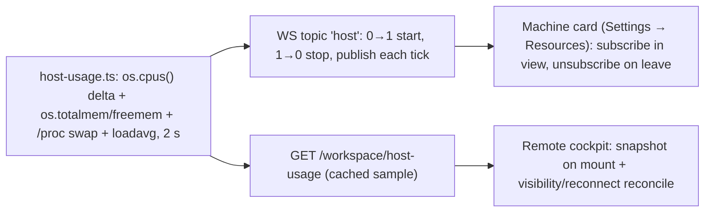

# Live host resource telemetry — the Machine card

> Slug: `host-resource-telemetry` · Status: **v2 — design, for specification review** · Brief:
> `.ai/specs/briefs/2026-09-20-host-resource-telemetry.md` · Precedents: the per-run sampler
> (`#348`, `packages/cezar/src/core/process-usage.ts`) and the WS subscription bus
> (`.ai/specs/2026-07-23-websocket-subscriptions.md`) · Review trail: units `906047e7`
> (doctrine/UX) and `3baaa393` (technical), both verdict *changes*, both folded into this v2 ·
> Delivery: this document ships design-only; one implementation PR follows separately
> (`Refs` this spec PR). **Sequencing:** the implementation lands after #1034
> (dispatch admission cap) — both touch `resources-section.tsx` and the docs inventory — and
> needs a base merge/rebase on `main` once #1034 merges.

## 📝 TLDR

The cockpit shows live CPU/RAM per task but nothing about the machine. The proposed behavior adds
a read-only host sampler (aggregate CPU %, memory, swap, load) that runs **only while the Machine
card in Settings → Resources is on screen**, streams over one demand-driven WS topic `host`, and
serves the same sample from `GET /api/v1/workspace/host-usage` for remote cockpits (snapshot +
the existing visibility/reconnect reconcile, no polling). The card shows a CPU bar with a 60 s
sparkline, a RAM bar, swap/load when the OS exposes them, and a client-measured freshness line,
labelled as host-level totals. No sidebar widget in v1 (deferred), no persistence, no database,
no new env var, no change to `health` or any existing payload.

## 📝 Problem Statement

- **Per-task telemetry exists; the host is invisible.** `process-usage.ts` ticks every ~2 s,
  aggregates each run's descendant tree into `{ cpuPct, rssBytes, procCount }`, streams it via SSE
  and the task tables render live CPU/Mem plus the persisted peak. Nothing aggregates the machine:
  a user sees a task at 4 GB RSS but not that the host has 2 GB free.
- **No host metrics exist today.** `GET /api/v1/health` carries version/repo/checks/capabilities
  (`packages/contract/src/health.ts`), and `totalmem|freemem|loadavg|os.cpus()` has zero hits in
  the repo. The only machine-wide read is the per-run `ps` snapshot.
- **The owner asked for it explicitly:** a live, visual view of "jak wyglądają zasoby maszyny, na
  której pracuje Cezar", so a fan-out's appetite is visible while it runs.

## 📝 Proposed Solution

1. **Sampler** (`packages/cezar/src/core/host-usage.ts`): `HOST_SAMPLE_INTERVAL_MS = 2_000`, one
   module-level timer that starts on the first listener (priming the CPU baseline, first tick
   after one interval) and stops on the last. It computes `cpuPct` from `os.cpus()` deltas
   (normalized 0–100, omitted until a baseline exists), `cpuCount` from
   `os.availableParallelism()`, memory from `os.totalmem()`/`os.freemem()`, swap by parsing
   `/proc/meminfo` (Linux only; absent elsewhere), and `loadAvg` from `os.loadavg()` (absent on
   Windows). Every field is best-effort; `sample()` never throws.
2. **WS topic `host`** registered in `createApp` behind `deps.socketHub?`, with the default
   trusted-only access. `snapshot()` is a **pure read of the last sample** (or a memory/load-only
   prime when none exists yet) — never a fresh CPU computation, because the hub calls `start()`
   before `snapshot()` (`ws.ts:161-174`). `start(publish)` primes the baseline, starts the timer and
   publishes each 2 s tick; the returned stop clears it. The topic publishes every tick while
   subscribed: the payload is a continuously varying gauge and `sampledAt` changes every tick, so a
   whole-payload change guard would be inert.
3. **Workspace route** `GET /api/v1/workspace/host-usage` (single-mount, never project-scoped)
   returns the same cached sample. It is the remote snapshot and the reconcile target; it answers
   200 with all required fields, never 503.
4. **UI: the Machine card** at the top of Settings → Resources. The card's own effect subscribes
   to the topic and returns the unsubscribe, so leaving the view stops the sampler (0→1/1→0). It
   shows CPU (value + bar + 60 s sparkline from 30 samples), RAM (used/total bar), swap when
   present, load when present, and "updated Xs ago" measured client-side. The value area is a
   labelled **host-level** view (container/cgroup caveat documented).

**Alternatives considered and rejected** (evidence in the brief):

| Alternative | Why it loses |
|-------------|--------------|
| Sidebar widget + root subscription in v1 | The sidebar is hidden below `md` and the drawer is normally closed, so "always visible" is false; the sampler would run for an invisible widget. Deferred to v2. |
| Remote `refetchInterval: 5_000` | Contradicts the WS spec's remote rule (HTTP bootstrap + SSE reconnect/visibility reconciliation); the card uses the existing reconcile seam instead. |
| `snapshot()` that computes a fresh sample | Races the baseline the hub's `start()` just primed (`ws.ts:161-174`) → NaN/0% on the first subscribe frame. |
| cgroup-aware memory/CPU in v1 | Platform-specific parsing; v1 labels host totals honestly instead. |
| Extending `GET /api/health` | CORS-open discovery payload with a 5 s cache; host metrics must not widen it. |
| Persisting samples / a chart library | The card needs 30 in-memory samples; SVG + existing tokens suffice. |
| Per-core, disk, network, GPU in v1 | Not required to answer "how is the machine doing"; disk-free-for-worktrees is the v2 candidate. |

## 📝 Architecture



**`host-usage.ts` module surface.**

```ts
export const HOST_SAMPLE_INTERVAL_MS = 2_000;
export interface HostUsage {
  sampledAt: string;
  cpuPct?: number;            // absent until a CPU baseline exists
  cpuCount: number;           // os.availableParallelism(), always >= 1
  memTotalBytes: number;
  memUsedBytes: number;
  memAvailableBytes: number;
  swapTotalBytes?: number;    // Linux /proc/meminfo only
  swapUsedBytes?: number;
  loadAvg?: { one: number; five: number; fifteen: number }; // absent on Windows
}
export function currentHostUsage(): HostUsage | undefined; // pure read
export function sampleHostUsage(): HostUsage;              // pure read, or memory/load-only prime
export function onHostUsage(listener: (u: HostUsage) => void): () => void; // 0→1 start / 1→0 stop
```

The timer is `unref()`ed like the process sampler. `swap` parsing tolerates a missing/unreadable
`/proc/meminfo`; `loadAvg` is omitted when `process.platform === 'win32'` or the values are
unavailable, not zeroed. The stale-guard for `snapshot()`/route is simply "last sample, whatever
its age" — the client renders the age; no second cache is introduced.

**Route & topic wiring.** The route joins the workspace-level chained family next to
`/workspace/config`; the topic registers exactly like `health`:

```ts
deps.socketHub?.registerTopic('host', {
  snapshot: async () => sampleHostUsage(),
  start: (publish) => onHostUsage(publish),
  // default options: trusted cockpit connections only
});
```

**Client.** `packages/web/src/api/host-usage.ts` exposes `workspaceQueryKeys.hostUsage`,
`useHostUsage()` (a cache read) and a `useHostUsageSubscription()` used **by the card**:
local mode subscribes via `subscribeTopic('host', …)` inside an effect that returns the
unsubscribe and folds each frame into the query cache; remote mode never opens a socket and
fetches the route on mount, with the existing `reconcile()` seam
(`global-events.tsx:313-337`) gaining a `hostUsage` key so visibility/reconnect refresh it. The
30-sample history is component state in the card (not a module-level global), appended on each
frame/query update. No other component touches the socket.

## 📝 Data Model

```ts
// packages/contract/src/host.ts — zod, type inferred
export const hostUsageSchema = z.object({
  sampledAt: z.string(),
  cpuPct: z.number().min(0).max(100).optional(),
  cpuCount: z.number().int().positive(),
  memTotalBytes: z.number().nonnegative(),
  memUsedBytes: z.number().nonnegative(),
  memAvailableBytes: z.number().nonnegative(),
  swapTotalBytes: z.number().nonnegative().optional(),
  swapUsedBytes: z.number().nonnegative().optional(),
  loadAvg: z.object({ one: z.number(), five: z.number(), fifteen: z.number() }).optional(),
});
```

Optional keys are spread conditionally on the wire (no `undefined` sent). No persistence: the
server keeps the latest sample only; the card keeps 30 samples (~60 s). No `~/.cezar` file, no
`data-gitignore` change, no DB.

## 📝 API Contracts

```ts
// GET /api/v1/workspace/host-usage — workspace-level, single-mount, normal API guard
// 200: hostUsageSchema
```

```ts
// WS topic 'host' — frame payload is hostUsageSchema; trusted connections only.
// snapshot: the last sample (memory/load-only before the first tick)
// start: primes the CPU baseline and publishes a sample every ~2 s while subscribed
// stop: clears the timer
```

No new error shape: the route only answers 200 (the fields are always computable). Gates: contract
parity for the route schema, the web typed-client call for reachability, `route-parity`'s
workspace-only list, and the `BACKWARD_COMPATIBILITY.md` §2 inventory. `typed-bodies`'s
`HasTypedInput` does **not** apply to a no-input GET.

## 📝 UI/UX

**Machine card (top of Settings → Resources, above "Max parallel tasks").**

- Header: `Machine` + a live dot in local mode (or `last known` in remote) + `updated 2 s ago`
  from a client receipt timestamp.
- CPU: `38%` with a bar and a 60 s sparkline (30 samples, one point per 2 s tick); thresholds
  neutral <60%, amber 60–85%, danger >85% using the real tokens (`--pending` fill,
  `text-pending-strong`) — never `text-amber-*`.
- Memory: stacked bar used/available + `12.4 GB / 32 GB` using the same byte formatter as the task
  table (`formatMem`).
- Swap row only when the sample carries swap; load row only when `loadAvg` is present (Windows
  hides the row rather than printing `n/a`).
- First tick: memory/load render immediately; the CPU area shows `sampling…` until `cpuPct`
  arrives, then the sparkline starts.
- Remote: values render with the `last known` label; a route fetch on mount and the
  visibility/reconnect reconcile keep them current; while visible nothing polls on an interval.
- Caveat line (small, muted): "Host totals — container/cgroup limits are not subtracted."
- Accessibility: sparkline is `role="img"` with an aria-label; numeric values are text next to it;
  no `aria-live` chatter.

**No sidebar widget in v1.** The deferred widget is described in "Deferred" below; the card is
the only consumer, which is what makes the per-view subscription (and therefore the 1→0 stop)
correct.

Prototype: `.ai/specs/assets/host-resource-telemetry/mockup-01-machine-card.html` (illustrative
static mockup; `mockup-01-machine-card.png` renders it, `current-01-resources.png` is today's
Settings → Resources screen on `origin/main` `4763447f`).

## 📝 Edge Cases & Failure Scenarios

| Scenario | Behavior |
|----------|----------|
| Nobody viewing the card | No subscription → no timer, no frames, zero cost. |
| First subscribe frame | `start()` primes the baseline, `snapshot()` returns memory/load with `cpuPct` absent; the first CPU point lands after one ~2 s tick. |
| `/proc/meminfo` unreadable | Swap fields omitted; memory still comes from `os`; nothing throws. |
| `os.cpus()` empty (no `/proc`) | `cpuCount` still ≥ 1 from `os.availableParallelism()`; `cpuPct` omitted each tick rather than faked. |
| Windows | `loadAvg` absent → the load row is hidden; CPU/memory work normally. |
| Container/cgroup | The card labels host totals and the docs carry the caveat; cgroup parsing is deferred. |
| Two tabs on the card | The client ref-counts listeners per topic: one publisher, one subscribe frame, two readers. |
| Remote mode | No WebSocket; route snapshot + reconcile; `last known` label. |
| Server restart | No persistence; the next subscription gets a fresh sample after one tick. |
| Clock skew | Freshness is client receipt time, not a comparison with `sampledAt`. |
| Unsubscribe leak | The card's effect returns the unsubscribe; a test pins topic stop on unmount. |

## 📝 Risks & Impact Review

- **Exposure.** Host metrics are low-sensitivity but the topic stays trusted-only and the route
  lives under the normal same-origin/loopback guard; no CORS widening, no `health` change.
- **Cost.** Zero timers without a subscriber; while the card is open, two cheap reads per 2 s
  (`os.cpus()` and one small `/proc` read). No dependency, no persistence, no DB, no env var.
- **Compatibility.** Additive: one new workspace route (§2 inventory), one new topic, new contract
  schemas; no existing payload changes. `.env.example` untouched.
- **Accuracy honesty.** Host-level totals labelled as such; first-tick CPU is `sampling…`, not 0%;
  missing swap/load fields hide rows instead of printing zeros.
- **Reversibility.** Remove the card/topic/route and nothing persists to clean up; older cockpits
  ignore the route.

## ✅ Resolved assumptions

Pre-answered by the brief's Resolved-unknowns table and the two design reviews; listed here so a
reviewer can override any single one before the implementation PR starts.

| # | Question | Applied answer | Rationale |
|---|----------|----------------|-----------|
| A1 | Metric set | CPU %, memory, swap (when present), load (when present), `cpuCount`, `sampledAt`. | Answers "how is the machine doing" with portable reads. |
| A2 | CPU shape | Aggregate 0–100, omitted before a baseline. | Per-core is unreadable at a glance; a fake 0% would be dishonest. |
| A3 | CPU count source | `os.availableParallelism()`. | `os.cpus()` can be empty where `/proc` is unavailable; availableParallelism is ≥ 1 and cgroup-quota aware. |
| A4 | Transport | WS topic (local, per-view) + workspace route (remote snapshot/reconcile). | The WS spec's pattern; no interval polling. |
| A5 | UI surface | Machine card only; sidebar widget deferred. | Both reviews: the widget would keep a publisher alive for an invisible element. |
| A6 | Containers | Host-level totals, labelled; cgroup parsing deferred. | Honest and portable; cgroups are platform-specific. |
| A7 | Persistence | None; server latest + card's 30 samples. | A live gauge needs no history on disk. |
| A8 | Freshness | Client receipt time; "updated Xs ago". | Avoids server-clock skew. |
| A9 | Access | Topic trusted-only; route normally guarded. | No reason to expose host data to foreign local pages. |
| A10 | v2 candidates | Sidebar glance widget, disk free for worktrees, per-core view, cgroup-aware numbers. | Explicitly deferred so v1 stays small. |

## 📋 Deferred (explicitly not in this spec)

- **Sidebar glance widget.** If added, its presence must decide the subscription scope: a
  hidden-by-default widget subscribes in its own view; an always-visible desktop widget would need
  a root subscription and an honest note that the sampler runs for the whole desktop session.
- **Disk free for worktrees** (`fs.statfs` on the data dir and the project root).
- **Per-core CPU** and **cgroup-aware** memory/CPU (`source: 'cgroup'`).
- **Per-task sparklines** in the task table (the live CPU/Mem cells already exist).

## 📋 Phasing

- **Phase 1 — server:** `host-usage.ts`, `hostUsageSchema`, the workspace route, the `host` topic,
  and their tests. Invisible to existing cockpits.
- **Phase 2 — cockpit:** the card's cache/subscription/reconcile wiring, the Machine card UI and
  state tests, `docs/reference.md` + `BACKWARD_COMPATIBILITY.md` §2.

## 📋 Implementation Plan

Every step leaves the app working and is covered by a test.

1. Add `hostUsageSchema` and its inferred type to the contract; test optional-field
   serialization both directions.
2. Implement `host-usage.ts`: injectable CPU snapshot source for delta math, memory from `os`,
   `/proc/meminfo` swap parsing, `availableParallelism`, platform-gated load, failure-soft sample,
   `currentHostUsage()`, `sampleHostUsage()` as a pure read/prime, `onHostUsage` ref-counted
   start/stop with an `unref()`ed timer.
3. Unit-test the sampler: baseline priming (first tick `cpuPct` absent), delta normalization,
   zero-delta omission, swap absent/unreadable, Windows load omitted, start/stop symmetry, no timer
   after the last unsubscribe, and that `sampleHostUsage()` never mutates the baseline.
4. Add `GET /workspace/host-usage` to the workspace chained family; extend contract-parity and the
   workspace-only `route-parity` list; add the §2 inventory entry; assert the typed client can call
   it (no `typed-bodies` entry — no input).
5. Register the `host` topic; test snapshot-before-first-tick (no `cpuPct`), snapshot purity,
   0→1 start / 1→0 stop, per-tick publishing, and that an untrusted connection is refused.
6. Add the web `host-usage` module: query key, cache folding, `useHostUsage()`, the card-scoped
   subscription (local) and remote route snapshot; add `hostUsage` to the existing reconcile seam;
   test subscribe-on-mount/unsubscribe-on-unmount, no interval in remote, and no socket in remote.
7. Build the Machine card: CPU bar + sparkline (30 samples), RAM bar, swap/load rows, freshness
   label, host-level caveat, threshold tokens, accessibility; test live, sampling, remote and
   missing-metric states.
8. Update `docs/reference.md` (Resources paragraph: live host totals + container caveat) and
   `BACKWARD_COMPATIBILITY.md` §2; run the full validation gate (`npm run typecheck`, `npm test`,
   `npm run test:unit`, `npm run build`, `npm run test:package`).

## 📚 Evidence

- Per-run telemetry precedent: `packages/cezar/src/core/process-usage.ts` (2 s sampler, module
  registry, `onUsage` subscribers, fail-soft `ps`) and `packages/web/src/lib/tasks-table.ts`
  (`usageCells`, `formatMem`).
- WS doctrine: `.ai/specs/2026-07-23-websocket-subscriptions.md` — `TopicPublisher`
  `snapshot`/`start`, demand-driven 0→1/1→0, "always return the unsubscribe", session-global vs
  per-view subscription scope, `loopbackReadable` defaults to false, remote = HTTP bootstrap + SSE
  reconcile (no WebSocket).
- Hub implementation: `packages/cezar/src/server/ws.ts` (`registerTopic`, `start()` before
  `snapshot()` at `:161-174`, trust check `:149-157`), the `health` registration in `server.ts`
  (`:1664-1682`), and the remote-no-WS gate (`queries.ts:703-706`).
- Host metrics absent today: `totalmem|freemem|loadavg|os.cpus|availableParallelism` → 0 hits in
  `packages/`; `healthResponseSchema` has no resource fields.
- Review evidence: units `906047e7` (doctrine/UX: remote interval, invisible-widget demand,
  container labelling, `dispatchMaxConcurrent` does not exist, scope mixing) and `3baaa393`
  (technical: `start()` before `snapshot()`, `os.cpus()` empty case, libuv `MemAvailable`-first,
  swap-only reason for `/proc`, publish-guard inertness, `typed-bodies` mismatch).
